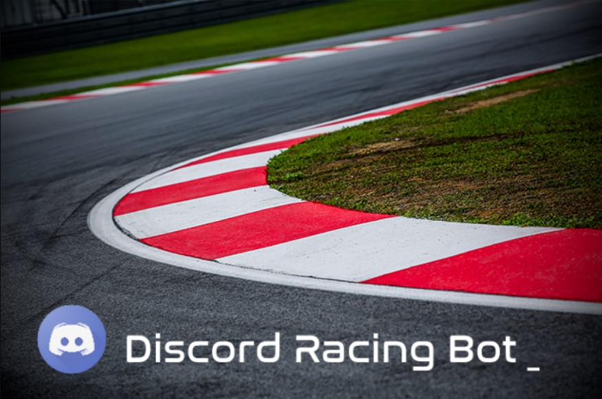

<div id="top"></div>

[![Contributors][contributors-shield]][contributors-url]
[![Forks][forks-shield]][forks-url]
[![Stargazers][stars-shield]][stars-url]
[![Issues][issues-shield]][issues-url]
[![MIT License][license-shield]][license-url]


<!-- PROJECT LOGO -->
<br />
<div align="center">
   <a href="https://github.com/othneildrew/Best-README-Template">
       
     </a>
  <p align="center">
    Discord Racing Bot: Earn, Race, Win...
    <br />
    <a href="https://discord.gg/FFSJPJJgcr">Join the Demo Discord Channel</a>
    ·
    <a href="https://github.com/CCSU-DesignPatterns-F21/final-project-f21-group3/issues">Report Bug</a>
    ·
    <a href="https://github.com/CCSU-DesignPatterns-F21/final-project-f21-group3/issues">Request Feature</a>
  </p>
</div>


<!-- ABOUT THE PROJECT -->
## About The Project

A Racing themed Discord Bot written in Java using MongoDB and JDA wrapper. Earn Credits, buy car components, build your custom race car and race against other members! 
Challenge other members for an impromtu drag race, register for the hourly tournaments with randomly generated racetracks, or test your car against the best of the best with adaily Grand Prix tournament with premium prizes. 


<p align="right">(<a href="#top">back to top</a>)</p>


### Built With

* [JDK 13](https://openjdk.java.net/projects/jdk/13/)
* [MongoDB](https://www.mongodb.com/)
* [JDA Discord Wrapper](https://github.com/DV8FromTheWorld/JDA)

<p align="right">(<a href="#top">back to top</a>)</p>

## Getting Started

Follow these directions to import the project into Eclipse so that it can be edited and built.

### Prerequisites

This is an example of how to list things you need to use the software and how to install them.
* Eclipse
* JDK 13
* MongoDB, Self-hosted or Atlas connection string
* Discord Bot registered with proper permissions and it's associated bot token.

### Installation

1. Install Open JDK 13, MongoDB (if self-hosted), Ecplise
2. Make sure that Eclipse is assigned the correct Java version in it's .ini file located within Eclipse installation directory.
3. Clone the repo
   ```sh
   git clone https://github.com/CCSU-DesignPatterns-F21/final-project-f21-group3.git
   ```
4. Open Eclipse, Import Existing Gradle project, browse and navigate to the directory with cloned repo, hit Next.
5. Select Override workspace settings and add new JVM Arguments with the value:
   ```
   -Djdk.tls.client.protocols=TLSv1.2
   ```
6. Project should now be imported properly.
7. In project explorer navigate to src/main/resouces (or create it) and create a file config.properties.
8. Within config.properties add the following lines (these contain important credentials, make sure you don't share them with anyone)
   ```
   discordChannelToken=<Your Discord Bot token>
   mongoDBUsername=<Your MongoDB Connection Password>
   mongoDBPass=<Your MongoDB connection username>
   mongoDBDatabase=RacingBot
   ```
9. Adjust the connection string in DBHandler.java to match your connection string.

<p align="right">(<a href="#top">back to top</a>)</p>


<!-- MARKDOWN LINKS & IMAGES -->
<!-- https://www.markdownguide.org/basic-syntax/#reference-style-links -->
[contributors-shield]: https://img.shields.io/github/contributors/CCSU-DesignPatterns-F21/final-project-f21-group3.svg?style=for-the-badge
[contributors-url]: https://github.com/CCSU-DesignPatterns-F21/final-project-f21-group3/graphs/contributors
[forks-shield]: https://img.shields.io/github/forks/CCSU-DesignPatterns-F21/final-project-f21-group3.svg?style=for-the-badge
[forks-url]: https://github.com/CCSU-DesignPatterns-F21/final-project-f21-group3/network/members
[stars-shield]: https://img.shields.io/github/stars/CCSU-DesignPatterns-F21/final-project-f21-group3.svg?style=for-the-badge
[stars-url]: https://github.com/CCSU-DesignPatterns-F21/final-project-f21-group3/stargazers
[issues-shield]: https://img.shields.io/github/issues/CCSU-DesignPatterns-F21/final-project-f21-group3.svg?style=for-the-badge
[issues-url]: https://github.com/CCSU-DesignPatterns-F21/final-project-f21-group3/issues
[license-shield]: https://img.shields.io/github/license/CCSU-DesignPatterns-F21/final-project-f21-group3.svg?style=for-the-badge
[license-url]: https://github.com/CCSU-DesignPatterns-F21/final-project-f21-group3/blob/master/LICENSE.txt
